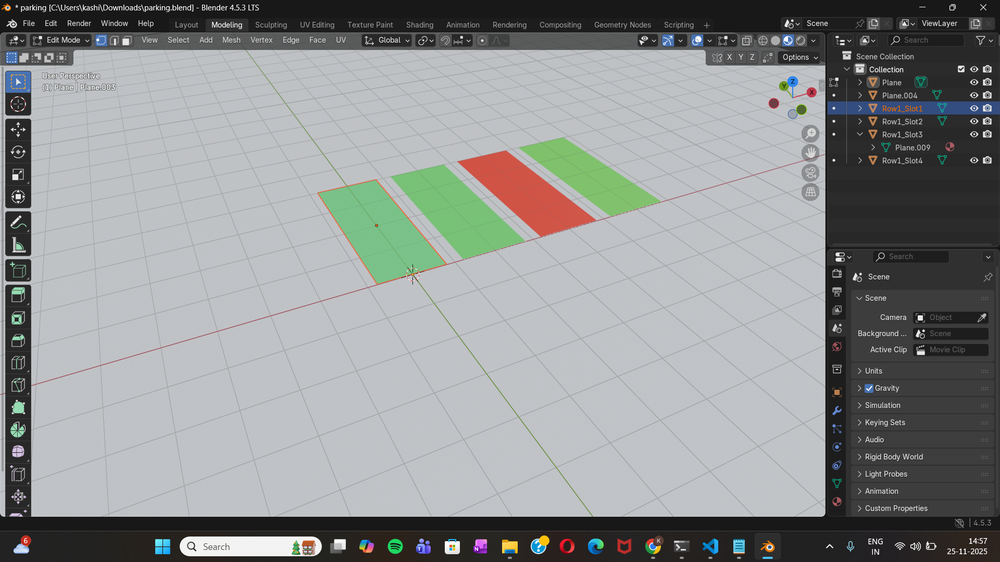
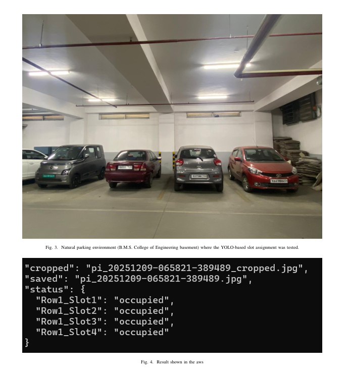

# smart-parking-digital-twin-system

# Smart Parking Digital Twin System

A real-time smart parking platform that combines computer vision, cloud infrastructure,
and a 3D digital twin to visualize live parking slot availability.

This project demonstrates an end-to-end system built using a Raspberry Pi, AWS cloud services,
YOLO-based vehicle detection, and a Three.js-powered digital twin for real-time visualization.

> ⚠️ Note: This repository presents a simplified engineering showcase.
> Certain algorithmic optimizations and research-specific details are intentionally omitted
> as they are part of ongoing academic publication work.

---

## 🚀 System Overview

The system monitors a parking area using a camera-based setup and reflects the real-time
status of each parking slot inside an interactive 3D digital twin.

**High-level flow:**

Raspberry Pi Camera  
→ Flask REST API (AWS EC2)  
→ YOLO-based Vehicle Detection  
→ Slot Occupancy Logic  
→ DynamoDB (Live + Historical Data)  
→ Three.js Digital Twin (Web)

---

## 🧠 Key Features

- Real-time image ingestion from edge device
- Cloud-based processing using Flask and AWS EC2
- Vehicle detection using pretrained YOLO models
- Slot-level occupancy estimation
- Live 3D Digital Twin visualization
- Historical data storage for analytics
- Future-time parking availability prediction

---

## 🛠 Tech Stack

- **Edge Device:** Raspberry Pi + Camera
- **Backend:** Python, Flask, OpenCV
- **Computer Vision:** YOLO (Ultralytics)
- **Cloud:** AWS EC2, DynamoDB
- **Frontend:** Three.js, HTML, CSS, JavaScript
- **3D Modeling:** Blender

---

## 🖼 Visual Demo

### 🧱 Digital Twin Model (Blender)


---

### 🖥 Live Digital Twin Dashboard (Three.js)


---

### 🚗 YOLO-based Vehicle Detection Output


---

### 🔮 Parking Availability Prediction


## 🧪 Running the Demo (High-Level)

This repository provides a high-level demonstration of the system workflow.

To run a local demo version of the backend:

```bash
pip install -r requirements.txt
python server.py
For the edge device (Raspberry Pi), a lightweight client captures images
and streams them to the backend service.

Note: Configuration details, datasets, trained models, and tuning parameters
are excluded from this repository and are part of ongoing academic work.

🔮 Future Enhancements
Multi-camera parking support
Advanced availability prediction models
Mobile and web dashboard integration
Smart city platform extensions

📄 Disclaimer
This repository is intended for demonstration and portfolio purposes only.
Core research logic, datasets, and optimization strategies are intentionally
omitted to protect ongoing academic publications.


